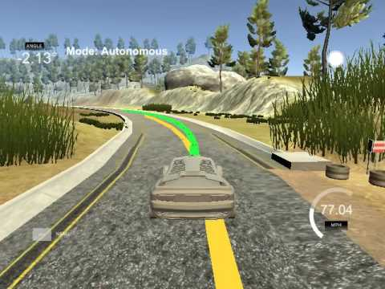

# CarND-Controls-MPC
Self-Driving Car Engineer Nanodegree Program
Implement Model Predictive Control to drive a car around the track in a simulator.
---

 

## Model

I used a kinematic model, which is a simplification of the real dynamics of the vehicle. The model used six states and two actuators (usually we use three actuators but in the simulator we are braking by negative throttle).

The states used are :

* px (position on x axis)
* py (position on y axis)
* psi (orientation from x axis)
* v (linear velocity)
* cte (cross track error)
* epsi (orientation error)

The actuators are:

* delta (steering angle in range [-25, +25] degree)
* throttle (in range [-1, 1])

Then based on all those variables we implement the model by basic dynamic equations.


```
x(t+1)      = x(t) + v(t) * cos(psi(t)) * dt
y(t+1)      = y(t) + v(t) * sin(psi(t))) * dt
psi(t+1)   = psi(t) + v(t) * delta(t) / Lf * dt;
v(t+1)      = v(t) + a(t) * dt;
cte(t+1)   = f(x(t)) - y(t) + v(t) * sin(epsi(t)) * dt;
epsi(t+1) = psi(t) - psides(x(t)) + v(t) * delta(t) / Lf * dt;
```
* dt = Elapse time between two updates, should be as small as possible.
* f(x) = Give the y coordinate on the reference trajectory that we try to follow.
* psides(x) = Give the psi on the reference trajectory. This is effectively equal to `atan(f'(x))`

Knowing the equations we need to solve them to get the next actuators value to follow a trajectory. In order to do it we use an optimization solver. Given the initial state, the solver will return the vector of actuations that minimize a cost function. 
 
## Cost function

The cost function used has seven distinctive cost.

* Cost from the CTE reference ( usually zero ) = `(CTE - ref_CTE)**2`
* Cost from the orientation reference ( usually zero) = `(psi -ref_psi)**2`
* Cost from the velocity reference (depends on speed limit) = `(v - ref_v)**2`
* Cost from delta (to minimize the use) = `delta**2`
* Cost from throttle (to minimize th use) = `throttle**2`
* Cost from sequential delta (to smooth the steering) = `(delta(t+1) - delta(t))**2`
* Cost from sequention throttle (to smooth acceleration/deceleration) = `(throttle(t+1) -throttle(t))**2`


## Waypoints polynomial fitting

In order to follow a path we are given waypoints of the expected trajectory. I fitted those waypoints with a 2nd degree polynom. I tried with a 3rd degree, but at high speed it was unstable and not really drivable, so decided to use a 2nd degree knowing that the simulator has not real complicated path.

## Horizon

In order to the solver to be able to solve our equations, it needs the elapse time dt and the number of step N forward we want to estimate.
Those numbers represent the horizon we are looking forward.
In the present project an actuation latency of 100ms has been introduced to simulate the physical latency effect between actuation order and execution. As we are as well doing some computation to solve the equations i have added 40ms computation latency.
So i ended with dt = 0.14s.
I chooses N=14, this was the biggest N i could afford on my computer. At high speed we need to look far ahead so the model can better anticipate. Below 14 it was unstable at high speed.

## Latency

To deal with the latency introduced by the actuation + computation, i used a dt that match the latency and i moved the initial state provided to the solver using the equations above instead of giving the current position.

## Results

Putting everything together.

* Convert velocity from mph to m/s
* Convert delta in rad
* Convert waypoints coordinates from map coords to car coords
* Fit a polynom on the waypoints
* Compute CTE and EPSI using the polynom at x=y=psi=0 (In car coordinate, the car is at 0)
* Compute the future state at latency time ahead
* Use the solver to get the actuators value.

In the simulator the yellow line is the waypoints line, the green line is the MPC predicted trajectory

* Around the track at 50mph using `./mpc` [Video](https://youtu.be/POPflyUtyLI) 
* Top speed at 108mph using `./mpc 120 14 3 200 0.05 1 0.1 280000 100`. Here we are using the full witdth of the track. [Video](https://youtu.be/M8FWZqPZGuo) 


#### MPC parameters

The mpc parameters are :

* Velocity reference
* N - Number of step for the solver
* factor CTE in cost function
* factor psi in cost function
* factor velocity in cost function
* factor delta in cost function
* factor throttle in cost function
* factor sequential delta in cost function
* factor sequential throttle in cost function


## Dependencies

* cmake >= 3.5
 * All OSes: [click here for installation instructions](https://cmake.org/install/)
* make >= 4.1
  * Linux: make is installed by default on most Linux distros
  * Mac: [install Xcode command line tools to get make](https://developer.apple.com/xcode/features/)
  * Windows: [Click here for installation instructions](http://gnuwin32.sourceforge.net/packages/make.htm)
* gcc/g++ >= 5.4
  * Linux: gcc / g++ is installed by default on most Linux distros
  * Mac: same deal as make - [install Xcode command line tools]((https://developer.apple.com/xcode/features/)
  * Windows: recommend using [MinGW](http://www.mingw.org/)
* [uWebSockets](https://github.com/uWebSockets/uWebSockets)
  * Run either `install-mac.sh` or `install-ubuntu.sh`.
  * If you install from source, checkout to commit `e94b6e1`, i.e.
    ```
    git clone https://github.com/uWebSockets/uWebSockets 
    cd uWebSockets
    git checkout e94b6e1
    ```
    Some function signatures have changed in v0.14.x. See [this PR](https://github.com/udacity/CarND-MPC-Project/pull/3) for more details.
* Fortran Compiler
  * Mac: `brew install gcc` (might not be required)
  * Linux: `sudo apt-get install gfortran`. Additionall you have also have to install gcc and g++, `sudo apt-get install gcc g++`. Look in [this Dockerfile](https://github.com/udacity/CarND-MPC-Quizzes/blob/master/Dockerfile) for more info.
* [Ipopt](https://projects.coin-or.org/Ipopt)
  * Mac: `brew install ipopt`
  * Linux
    * You will need a version of Ipopt 3.12.1 or higher. The version available through `apt-get` is 3.11.x. If you can get that version to work great but if not there's a script `install_ipopt.sh` that will install Ipopt. You just need to download the source from the Ipopt [releases page](https://www.coin-or.org/download/source/Ipopt/) or the [Github releases](https://github.com/coin-or/Ipopt/releases) page.
    * Then call `install_ipopt.sh` with the source directory as the first argument, ex: `bash install_ipopt.sh Ipopt-3.12.1`. 
  * Windows: TODO. If you can use the Linux subsystem and follow the Linux instructions.
* [CppAD](https://www.coin-or.org/CppAD/)
  * Mac: `brew install cppad`
  * Linux `sudo apt-get install cppad` or equivalent.
  * Windows: TODO. If you can use the Linux subsystem and follow the Linux instructions.
* [Eigen](http://eigen.tuxfamily.org/index.php?title=Main_Page). This is already part of the repo so you shouldn't have to worry about it.
* Simulator. You can download these from the [releases tab](https://github.com/udacity/self-driving-car-sim/releases).
* Not a dependency but read the [DATA.md](./DATA.md) for a description of the data sent back from the simulator.


## Basic Build Instructions


1. Clone this repo.
2. Make a build directory: `mkdir build && cd build`
3. Compile: `cmake .. && make`
4. Run it: `./mpc`.

